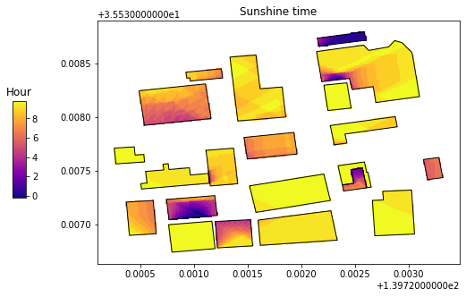
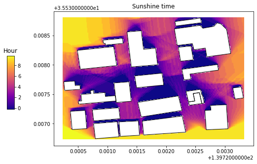

# pybdshadow 


[](https://pybdshadow.readthedocs.io/en/latest/?badge=latest) [](https://pepy.tech/project/pybdshadow) [](https://codecov.io/gh/ni1o1/pybdshadow) [](https://github.com/ni1o1/pybdshadow/actions/workflows/tests.yml)

## Introduction

`pybdshadow` is a python package for generating, analyzing and visualizing building shadows.
The latest stable release of the software can be installed via pip and full documentation can be found [here](https://pybdshadow.readthedocs.io/en/latest/).

## Example
## Usage

### Shadow generated by Sun light

Detail usage can be found in [this example](https://github.com/ni1o1/pybdshadow/blob/main/example/example-calculation.ipynb).
`pybdshadow` is capable of generating shadows from building outline data.
Building outline data can be obtain by Python package [OSMnx](https://osmnx.readthedocs.io/en/stable/) from OpenStreetMap.
The buildings are usually store in the data as the form of Polygon object with `height` column.

```python
import pandas as pd
import geopandas as gpd
#Read building data
buildings = gpd.read_file(r'data/bd_demo_2.json')
```

Given a building GeoDataFrame and UTC datetime, `pybdshadow` can calculate the building shadow based on the sun position obtained by `suncalc`

```python
import pybdshadow
#Given UTC datetime
date = pd.to_datetime('2022-01-01 12:45:33.959797119')\
    .tz_localize('Asia/Shanghai')\
    .tz_convert('UTC')
#Calculate building shadow for sun light
shadows = pybdshadow.bdshadow_sunlight(buildings,date)
```

`pybdshadow` also provide visualization method supported by keplergl.

```python
# visualize buildings and shadows
pybdshadow.show_bdshadow(buildings = buildings,shadows = shadows)
```


`pybdshadow` also have the functionality to calculate the shadow on the roof.


### Shadow generated by Point light

`pybdshadow` can also calculate the building shadow generated by point light. Given coordinates and height of the point light:

```python
#Calculate building shadow for point light
shadows = pybdshadow.bdshadow_pointlight(buildings,139.713319,35.552040,200)
#Visualize buildings and shadows
pybdshadow.show_bdshadow(buildings = buildings,shadows = shadows)
```


### Shadow coverage analysis(sunshine time)
### Shadow coverage analysis

`pybdshadow` also have the functionality to calculate the shadow on the roof.


`pybdshadow` provides the functionality to analysis sunshine time on the roof and on the ground. Detail usage can be found in [this example](https://github.com/ni1o1/pybdshadow/blob/main/example/example-analysis.ipynb).

Base on this functionality, `pybdshadow` can also analysis sunshine time on the roof and on the ground. Detail usage can be found in [this example](https://github.com/ni1o1/pybdshadow/blob/main/example/example-analysis.ipynb).
Result of shadow coverage on the roof:



Result of shadow coverage on the roof.
Result of sunshine time on the ground:



Result of shadow coverage on the ground.

## Installation

It is recommended to use `Python 3.7, 3.8, 3.9`

### Using pypi [](https://badge.fury.io/py/pybdshadow)

`pybdshadow` can be installed by using `pip install`. Before installing `pybdshadow`, make sure that you have installed the available [geopandas package](https://geopandas.org/en/stable/getting_started/install.html). If you already have geopandas installed, run the following code directly from the command prompt to install `pybdshadow`:

```python
pip install pybdshadow
```

## Dependency

`pybdshadow` depends on the following packages

* `numpy`
* `pandas`
* `shapely`
* `rtree`
* `geopandas`
* `matplotlib`
* [`suncalc`](https://github.com/kylebarron/suncalc-py)
* `keplergl`

## Citation information

Citation information can be found at [CITATION.cff](https://github.com/ni1o1/pybdshadow/blob/main/CITATION.cff).

## Contributing to pybdshadow [](https://github.com/ni1o1/pybdshadow/graphs/contributors) 

All contributions, bug reports, bug fixes, documentation improvements, enhancements and ideas are welcome. A detailed overview on how to contribute can be found in the [contributing guide](https://github.com/ni1o1/pybdshadow/blob/master/CONTRIBUTING.md) on GitHub.
